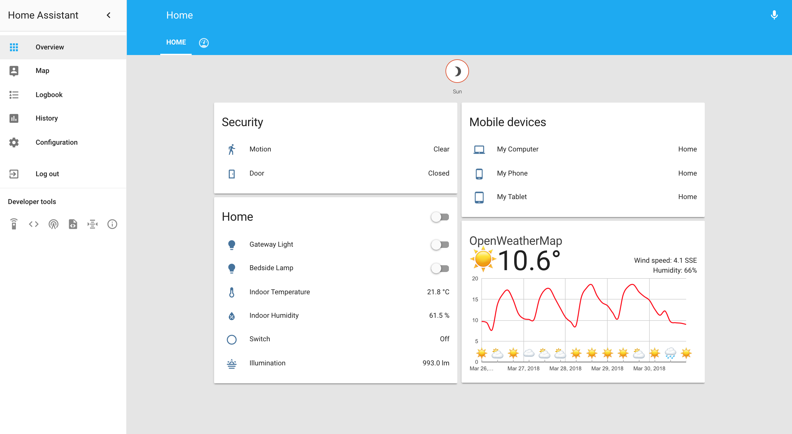
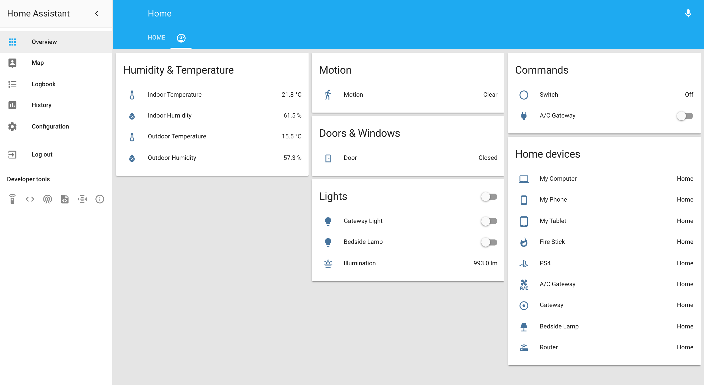
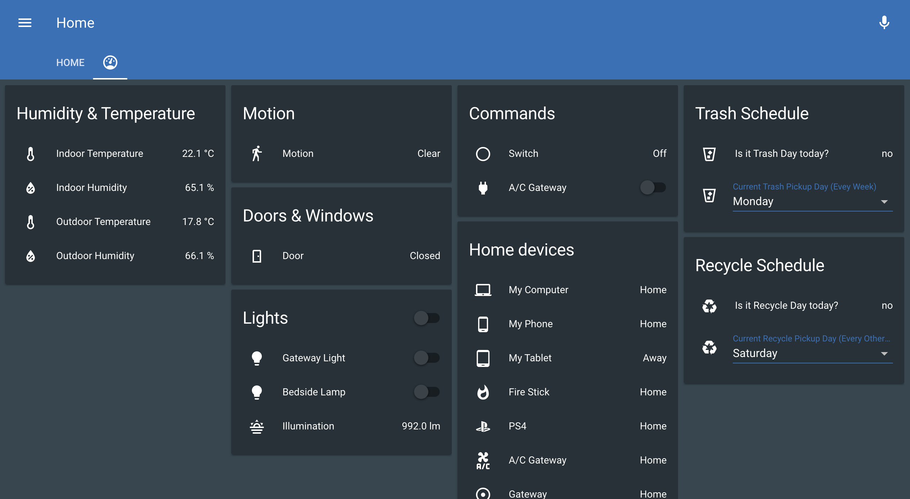

# Home Assistant
Example [Home Assistant](https://home-assistant.io) Configs

Home Assistant Version: 0.65.5

# Devices

* [Xiaomi Gateway (Aqara)](https://www.mi.com/wangguan/)
* [Xiaomi A/C Gateway](https://www.mi.com/ac-controller/) - A/C Controller Plug
* [Xiaomi Switch](https://item.mi.com/1164900029.html)
* [Xiaomi Plug (ZigBee)](https://item.mi.com/1164900030.html)
* [Xiaomi Temperature Sensor](https://item.mi.com/1164900031.html) - x2 
(Temperature and Humidity, indoor and outdoor)
* [Xiaomi Motion Sensor](https://item.mi.com/1164900028.html)
* [Xiaomi Bedside Lamp](https://www.mi.com/mj-bedsidelamp/)
* [Plex Media Server](https://plex.tv)
# Interface
* Default View

* Sensors View

* Night Theme
